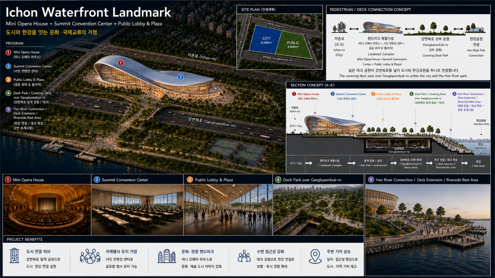

# IchonRedev

이촌동 초입구역의 상대가격 변화, 특별계획구역 가능성, 주거·상업·공공용지 개발 시나리오를 정리한 HTML article입니다.

## Read the Article

[Open the HTML article](https://deephouse1999.github.io/IchonRedev/article.html)

## Site

[Open the landing page](https://deephouse1999.github.io/IchonRedev/)

## Proposal PDF

[이촌동초입통합재개발안.pdf](https://deephouse1999.github.io/IchonRedev/%EC%9D%B4%EC%B4%8C%EB%8F%99%EC%B4%88%EC%9E%85%ED%86%B5%ED%95%A9%EC%9E%AC%EA%B0%9C%EB%B0%9C%EC%95%88.pdf)

